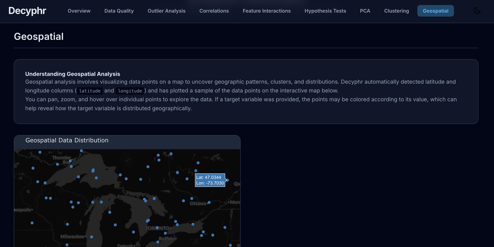
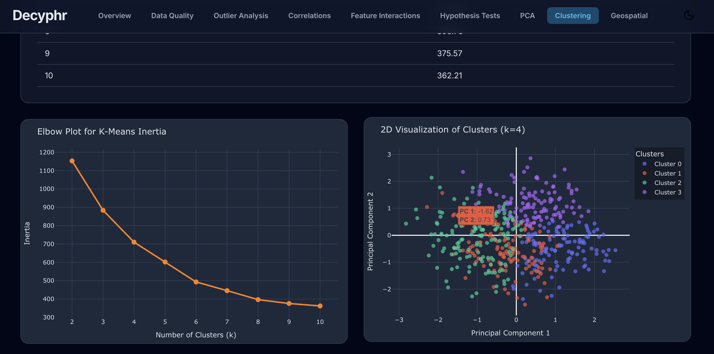

# Decyphr

An all-encompassing, automated toolkit for generating deep, professional, and interactive Deep Data Analysis reports with a single line of code. It's not just a normal EDA.

Decyphr is designed to accelerate the data science workflow by automating the tedious and time-consuming process of initial data exploration. It goes beyond basic profiling to provide deep statistical insights, advanced machine learning-driven analysis, and a stunning, presentation-ready report that is as beautiful as it is informative.

## Key Features

Decyphr provides a comprehensive suite of analyses, intelligently triggered based on your data's characteristics:

Complete Overview: Instant summary of dataset shape, memory usage, variable types, and data quality warnings.

Deep Univariate Analysis: Detailed statistical profiles, histograms, and frequency charts for every variable.

Multivariate Analysis: Stunning, interactive heatmaps for both linear (Pearson) and non-linear (Phik) correlations.

Advanced Data Quality: Automatically detects constant columns, whitespace issues, and potential outliers using multiple methods (IQR, Isolation Forest).

Statistical Inference: Performs automated Hypothesis Testing (T-Tests, ANOVA, Chi-Squared) to uncover statistically significant relationships.

Machine Learning Insights:
PCA: Analyzes dimensionality reduction possibilities.
Clustering: Automatically finds hidden segments in your data using K-Means.
Feature Importance: Trains a baseline model to identify the most predictive features when a target is provided.
Explainable AI (XAI): Generates SHAP summary plots to explain how your features impact model predictions.

Specialized Analysis: Includes dedicated modules for Deep Text Analysis (Sentiment, NER, Topics), Time-Series Decomposition, and Geospatial Mapping.

Data Drift Detection: Compare two datasets to quantify changes in data distribution over time.

High-End Interactive Report: A beautiful, modern dashboard with a toggleable light/dark theme, responsive charts, and a professional UI/UX.

## Quick Start

1. Installation

!pip install decyphr

2. Importing

import decyphr

3. Running Analysis

decyphr.analyze(filepath="data/your_data.csv")

4. Generating Report (Jupyter Notebook)

import os, webbrowser
path = os.path.abspath('Reports/your_generated_report_name.html')
webbrowser.open(f'file://{path}')

5. Generating Report (Google Colab)

from google.colab import files
files.download("reports/your_report_name.html")

# Generated Your First Report

Create a Python script add the above code. Just point it to your dataset and let Decyphr do the rest.

Your professional, interactive HTML report will be automatically saved in a new decyphr_reports/ directory.

## Project Structure

This project uses a highly modular "plugin" architecture to ensure it is robust, maintainable, and easy to extend. All analysis and visualization logic is separated into self-contained modules located in the src/decyphr/analysis_plugins/ directory.

## Capabilities

While there is no end of this vast ocean but as of now Decyphr can process more than 1 lakh rows with over 1 lakh cells in less than 3 mins. Isn't that amazing !

## Contributing

Contributions are what make the open-source community such an amazing place to learn, inspire, and create. Any contributions you make are greatly appreciated. Please feel free to fork the repo and create a pull request, or open an issue with suggestions.

## License

Distributed under the MIT License. See LICENSE file for more information.
Designed and Created by - Ayush Singh